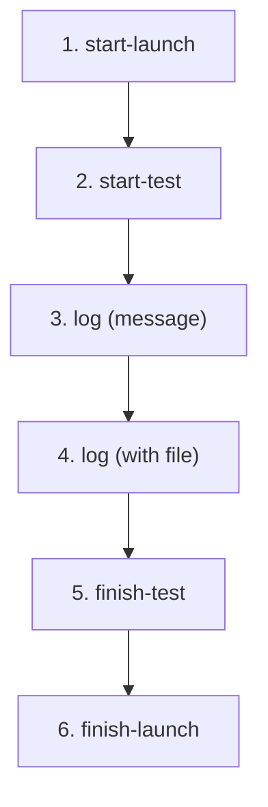

# ReportPortal Reporting (gorp)

## Prerequisites & global config

Connection settings come from three sources (highest precedence last):

1. Config file `~/.gorp` (JSON: `host`, `project`, `api_key`) — created by `gorp init`
2. Environment variables: `GORP_API_KEY`, `GORP_PROJECT` (plus per-command env vars documented below)
3. CLI flags: `--host`, `--api-key`/`-u` (alias `--uuid`, deprecated), `--project`/`-p`

Global flags (set on the root `gorp` command, before the subcommand):

| Flag | Alias | Env | Default | Description |
|------|-------|-----|---------|-------------|
| `--api-key` | `-u`, `--uuid` (deprecated) | `GORP_API_KEY`, `GORP_UUID` (deprecated) | | API Key (user token) |
| `--project` | `-p` | `GORP_PROJECT` | | ReportPortal project name |
| `--host` | | | | ReportPortal server URL |
| `--log-level` | | | `debug` | Logging level (`debug`, `info`, `warn`, `error`) |

`--uuid`/`GORP_UUID` still work but log a deprecation warning — prefer `--api-key`/`GORP_API_KEY`.

## Reporting Lifecycle



Suites are test items with `--type SUITE`. Child items use `--parent-uuid`.

---

## 1. start-launch

Start a new launch. Prints the launch UUID to stdout.

```sh
LAUNCH_UUID=$(gorp report start-launch \
  --name "My Launch" \
  --description "Nightly run" \
  --attr "branch:main" \
  --attr "ci" \
  --mode DEFAULT)
```

| Flag | Short | Env | Default | Description |
|------|-------|-----|---------|-------------|
| `--name` | `-n` | | | **Required.** Launch name |
| `--description` | | | | Launch description |
| `--attr` | `-a` | | | Attribute `key:value` or `value` (repeatable) |
| `--mode` | | | `DEFAULT` | `DEFAULT` or `DEBUG` |

---

## 2. start-test

Start a test item. Prints the item UUID to stdout. Use `--parent-uuid` to nest under a suite.

```sh
# Root item (suite)
SUITE_UUID=$(gorp report start-test \
  --launch-uuid "$LAUNCH_UUID" \
  --name "my/package" \
  --type SUITE)

# Child item (test under suite)
TEST_UUID=$(gorp report start-test \
  --launch-uuid "$LAUNCH_UUID" \
  --parent-uuid "$SUITE_UUID" \
  --name "TestSomething" \
  --type TEST \
  --code-ref "my/package/TestSomething")
```

| Flag | Short | Env | Default | Description |
|------|-------|-----|---------|-------------|
| `--launch-uuid` | | `LAUNCH_UUID` | | **Required.** Launch UUID |
| `--name` | `-n` | | | **Required.** Item name |
| `--type` | `-t` | | `TEST` | `SUITE`, `TEST`, `STEP`, `SCENARIO`, etc. |
| `--parent-uuid` | | `PARENT_UUID` | | Parent UUID (creates child item) |
| `--description` | | | | Description |
| `--code-ref` | | | | Source code reference |
| `--attr` | `-a` | | | Attribute (repeatable) |

---

## 3. log (message)

Attach a plain-text log entry to a test item or launch. Prints the log ID.

```sh
gorp report log \
  --launch-uuid "$LAUNCH_UUID" \
  --item-uuid "$TEST_UUID" \
  --message "Test started successfully" \
  --level INFO
```

| Flag | Short | Env | Default | Description |
|------|-------|-----|---------|-------------|
| `--launch-uuid` | | `LAUNCH_UUID` | | **Required.** Launch UUID |
| `--item-uuid` | | `ITEM_UUID` | | Test item UUID (omit for launch-level log) |
| `--message` | `-m` | | | **Required.** Log message |
| `--level` | | | `INFO` | `DEBUG`, `INFO`, or `ERROR` |

---

## 4. log (with file)

Same as above, plus `--file` to attach a binary file (screenshot, artifact, etc.).

```sh
gorp report log \
  --launch-uuid "$LAUNCH_UUID" \
  --item-uuid "$TEST_UUID" \
  --message "Failure screenshot" \
  --level ERROR \
  --file screenshot.png
```

| Flag | Short | Description |
|------|-------|-------------|
| `--file` | `-f` | Path to a file to attach |

---

## 5. finish-test

Close a test item with a final status. Works for both tests and suites.

```sh
gorp report finish-test \
  --launch-uuid "$LAUNCH_UUID" \
  --item-uuid "$TEST_UUID" \
  --status PASSED
```

| Flag | Short | Env | Default | Description |
|------|-------|-----|---------|-------------|
| `--launch-uuid` | | `LAUNCH_UUID` | | **Required.** Launch UUID |
| `--item-uuid` | | `ITEM_UUID` | | **Required.** Test item UUID |
| `--status` | | | | Optional. `PASSED`, `FAILED`, `SKIPPED`, etc. |

---

## 6. finish-launch

Close the launch with a final status.

```sh
gorp report finish-launch \
  --launch-uuid "$LAUNCH_UUID" \
  --status PASSED
```

| Flag | Short | Env | Default | Description |
|------|-------|-----|---------|-------------|
| `--launch-uuid` | | `LAUNCH_UUID` | | **Required.** Launch UUID |
| `--status` | | | | Optional. `PASSED`, `FAILED`, `STOPPED`, etc. |

---

## Full Example (all 6 steps)

```sh
export GORP_API_KEY="your_token"
export GORP_PROJECT="my_project"

# 1. Start launch
LAUNCH_UUID=$(gorp report start-launch --host https://rp.example.com \
  --name "CI Run" --attr "branch:main")

# 2. Start suite + test
SUITE_UUID=$(gorp report start-test \
  --launch-uuid "$LAUNCH_UUID" --name "pkg/foo" --type SUITE)
TEST_UUID=$(gorp report start-test \
  --launch-uuid "$LAUNCH_UUID" --parent-uuid "$SUITE_UUID" \
  --name "TestBar" --type TEST)

# 3. Log message
gorp report log --launch-uuid "$LAUNCH_UUID" --item-uuid "$TEST_UUID" \
  --message "=== RUN TestBar" --level INFO

# 4. Log with file
gorp report log --launch-uuid "$LAUNCH_UUID" --item-uuid "$TEST_UUID" \
  --message "Screenshot" --level ERROR --file fail.png

# 5. Finish test + suite
gorp report finish-test \
  --launch-uuid "$LAUNCH_UUID" --item-uuid "$TEST_UUID" --status PASSED
gorp report finish-test \
  --launch-uuid "$LAUNCH_UUID" --item-uuid "$SUITE_UUID" --status PASSED

# 6. Finish launch
gorp report finish-launch --launch-uuid "$LAUNCH_UUID" --status PASSED
```

---

## test2json Pipeline

Report `go test -json` output in a single command (handles the full launch→suite→test→log→finish
lifecycle automatically, one suite per Go package, one test item per Go test function).

```sh
# Pipe from go test
go test -json ./... | gorp report test2json \
  --launchName "CI Run" --attr "branch:main"

# From a file
gorp report test2json --file results.jsonl

# Report + quality gate in one step
go test -json ./... | gorp report test2json --quality-gate-check
```

| Flag | Short | Env | Default | Description |
|------|-------|-----|---------|-------------|
| `--file` | `-f` | `FILE` | | Read test2json input from a file instead of stdin |
| `--launchName` | `-ln` | `LAUNCH_NAME` | `"gorp launch"` | Launch name |
| `--reportEmptyPkg` | `-ep` | `REPORT_EMPTY_PKG` | `false` | Report packages with no test files as a launch item |
| `--attr` | `-a` | | | Launch attribute `key:value` or `value` (repeatable) |
| `--print-launch-uuid` | | | `false` | Print the launch UUID after reporting completes |
| `--quality-gate-check` | `-qgc` | `QUALITY_GATE_CHECK` | `false` | Poll the quality gate after reporting; exits **10** on non-`PASSED` status |
| `--quality-gate-timeout` | `-qgt` | `QUALITY_GATE_TIMEOUT` | `1m` | Shared with `quality-gate check` |
| `--quality-gate-check-interval` | `-qgci` | `QUALITY_GATE_CHECK_INTERVAL` | `3s` | Shared with `quality-gate check` |

### Go 1.27+ output handling

Starting with Go 1.27, `go test -json` annotates `"action":"output"` events with an `OutputType`
field: `"frame"` (test framing like `=== RUN`/`--- FAIL:`), `"error"` (first chunk of a
`t.Error`/`t.Fatal` call), `"error-continue"` (continuation chunks), or blank for plain output.
`gorp` uses this to:

- Promote `error`/`error-continue` output to `ERROR`-level RP logs (plain/frame output stays `INFO`).
- Merge `error-continue` chunks into the previous log entry so a multi-line `t.Error` becomes one
  RP log instead of several.
- Fall back to the pre-1.27 heuristic (tab-indented continuation lines) when `OutputType` is absent,
  so older Go toolchains still work.

No flags are needed to enable this — it's automatic based on whether the incoming stream has
`OutputType` set. See `internal/commands/report.go` (`logLevelForOutputType`, `shouldMergeOutput`)
and `internal/commands/report_log_test.go` for the exact behavior and test fixtures.

---

## Quality Gate

```sh
# Direct UUID
gorp quality-gate check --launch-uuid "$LAUNCH_UUID"

# Piped from report
go test -json ./... \
  | gorp report test2json --print-launch-uuid \
  | gorp quality-gate check --stdin
```

`--launch-uuid` and `--stdin` are **mutually exclusive and one is required** — pass exactly one.
Exits with exit code **10** if the quality gate status is not `PASSED` (this exit code is relied
on by CI pipelines; don't rely on stdout parsing instead).

| Flag | Short | Env | Default | Description |
|------|-------|-----|---------|-------------|
| `--launch-uuid` | | `LAUNCH_UUID` | | Launch UUID to check (mutually exclusive with `--stdin`) |
| `--stdin` | | | `false` | Read launch UUID from stdin (mutually exclusive with `--launch-uuid`) |
| `--quality-gate-timeout` | `-qgt` | `QUALITY_GATE_TIMEOUT` | `1m` | Maximum wait |
| `--quality-gate-check-interval` | `-qgci` | `QUALITY_GATE_CHECK_INTERVAL` | `3s` | Poll interval |

Command aliases: `quality-gate` → `qg`, `check` → `qgc` (so `gorp qg qgc --stdin` also works).

---

## Launch operations

```sh
# List launches (optionally filtered)
gorp launch list --filter-name "My Filter"
gorp launch list --filter "name%CNT%nightly"

# Merge launches by explicit IDs
gorp launch merge --name "Merged Run" --ids 101 --ids 102 --type DEEP

# Merge launches matched by a saved filter
gorp launch merge --name "Merged Run" --filter-name "My Filter"
```

| Command | Flag | Short | Env | Default | Description |
|---------|------|-------|-----|---------|-------------|
| `list` | `--filter-name` | `-fn` | `FILTER_NAME` | | Use a saved RP filter |
| `list` | `--filter` | `-f` | `Filter` | | Raw filter expression(s), repeatable, ANDed |
| `merge` | `--name` | `-n` | `MERGE_LAUNCH_NAME` | | **Required.** Name for the merged launch |
| `merge` | `--ids` | | `MERGE_LAUNCH_IDS` | | Explicit launch IDs to merge (repeatable) |
| `merge` | `--filter` | `-f` | `MERGE_LAUNCH_FILTER` | | Filter expression to select launches to merge |
| `merge` | `--filter-name` | `-fn` | `FILTER_NAME` | | Saved filter to select launches to merge |
| `merge` | `--type` | (canonical flag name is `-t`, `--type` is its alias) | `MERGE_TYPE` | `DEEP` | `DEEP` or `BASIC` |

`merge` requires either `--ids` or one of `--filter`/`--filter-name` — if none are given, the
command errors with "either IDs or filter must be provided".

---

## Using the Go library directly (`pkg/gorp`)

For programmatic reporting (not shelling out to `gorp`), use `ReportingClient` from
`github.com/reportportal/goRP/v5/pkg/gorp`:

```go
ctx := context.Background()
rc := gorp.NewReportingClient(host, project, gorp.WithApiKeyAuth(ctx, apiKey))

launch, _ := rc.StartLaunch(ctx, &openapi.StartLaunchRQ{
    Name: "my-launch", StartTime: time.Now(),
    Mode: openapi.PtrString(string(gorp.LaunchModes.Default)),
})
test, _ := rc.StartTest(ctx, &openapi.StartTestItemRQ{
    LaunchUuid: *launch.Id, Name: "MyTest",
    Type: string(gorp.TestItemTypes.Test), StartTime: time.Now(),
})
rc.SaveLog(ctx, &openapi.SaveLogRQ{
    LaunchUuid: *launch.Id, ItemUuid: test.Id,
    Level: openapi.PtrString(gorp.LogLevelInfo), Time: time.Now(),
    Message: openapi.PtrString("log message"),
})
rc.FinishTest(ctx, *test.Id, &openapi.FinishTestItemRQ{
    LaunchUuid: *launch.Id, EndTime: time.Now(),
    Status: openapi.PtrString(string(gorp.Statuses.Passed)),
})
rc.FinishLaunch(ctx, *launch.Id, &openapi.FinishExecutionRQ{
    Status: openapi.PtrString(string(gorp.Statuses.Passed)), EndTime: time.Now(),
})
```

Key `ReportingClient` methods (all take `ctx context.Context` first; `*Raw` variants accept
`json.RawMessage` instead of a typed request):

| Method | Purpose |
|--------|---------|
| `StartLaunch` / `StartLaunchRaw` | Start a launch |
| `FinishLaunch` / `FinishLaunchRaw` | Finish a launch |
| `StopLaunch` | Force-stop a launch (`Statuses.Stopped`, `EndTime: time.Now()`) |
| `StartTest` / `StartTestRaw` | Start a root-level test item |
| `StartChildTest` / `StartChildTestRaw` | Start a nested item under a parent UUID |
| `FinishTest` / `FinishTestRaw` | Finish a test item (works for suites too) |
| `SaveLog` | Save a single log |
| `SaveLogs` | Batch-save logs, no file attachments |
| `SaveLogMultipart` | Batch-save logs with file attachments (`[]Multipart`) |

File attachments implement the `Multipart` interface (`multipart.go`):

```go
type Multipart interface {
    Load() (fileName, contentType string, reader io.Reader, err error)
}
```

Two ready-made implementations: `&gorp.FileMultipart{File: f}` (derives name/content-type from
an `*os.File`) and `&gorp.ReaderMultipart{FileName, ContentType, Reader}` (explicit fields for an
arbitrary `io.Reader`). Each `SaveLogRQ.File.Name` in the batch must match a `Multipart`'s filename.

Read-only/administrative operations (listing/merging launches, without the reporting API) go
through `gorp.Client` (`client.go`), which embeds the generated `pkg/openapi` client:

```go
c := gorp.NewClient(parsedURL, gorp.WithApiKeyAuth(ctx, apiKey))
launches, _, _ := c.LaunchAPI.GetProjectLaunches(ctx, project).Execute()
```

Auth options (both `NewClient` and `NewReportingClient` accept one):

```go
func WithApiKeyAuth(ctx context.Context, apiKey string) ClientOption
func WithPasswordOwnerGrantAuth(ctx context.Context, cfg *oauth2.Config, username, password string) ClientOption
```

---

## Statuses

`PASSED`, `FAILED`, `STOPPED`, `SKIPPED`, `INTERRUPTED`, `CANCELLED` (Go identifier is
`gorp.Statuses.Canceled`, American spelling — but it serializes to the British `"CANCELLED"` to
match the RP API; don't "fix" the string), `INFO`, `WARN`.

## Test Item Types

`SUITE`, `TEST`, `STEP`, `SCENARIO`, `STORY`, `BEFORE_CLASS`, `BEFORE_GROUPS`, `BEFORE_METHOD`, `BEFORE_SUITE`, `BEFORE_TEST`, `AFTER_CLASS`, `AFTER_GROUPS`, `AFTER_METHOD`, `AFTER_SUITE`, `AFTER_TEST`

## Log Levels

`DEBUG`, `INFO`, `ERROR`

## Launch Modes / Merge Types

Launch mode: `DEFAULT`, `DEBUG`. Merge type: `DEEP`, `BASIC`.
