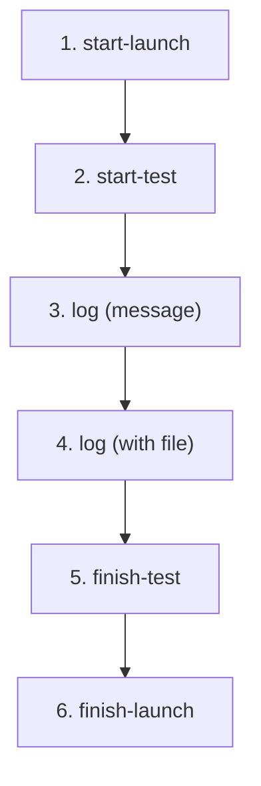

# ReportPortal Reporting (CLI)

## Prerequisites

Connection settings come from three sources (highest precedence last):

1. Config file `~/.gorp` (created by `gorp init`)
2. Environment variables: `GORP_API_KEY`, `GORP_PROJECT`
3. CLI flags: `--host`, `--api-key`, `--project`

## Reporting Lifecycle



Suites are test items with `--type SUITE`. Child items use `--parent-uuid`.

---

## 1. start-launch

Start a new launch. Prints the launch UUID to stdout.

```sh
LAUNCH_UUID=$(gorp report start-launch \
  --name "My Launch" \
  --description "Nightly run" \
  --attr "branch:main" \
  --attr "ci" \
  --mode DEFAULT)
```

| Flag | Short | Env | Default | Description |
|------|-------|-----|---------|-------------|
| `--name` | `-n` | | | **Required.** Launch name |
| `--description` | | | | Launch description |
| `--attr` | `-a` | | | Attribute `key:value` or `value` (repeatable) |
| `--mode` | | | `DEFAULT` | `DEFAULT` or `DEBUG` |

---

## 2. start-test

Start a test item. Prints the item UUID to stdout. Use `--parent-uuid` to nest under a suite.

```sh
# Root item (suite)
SUITE_UUID=$(gorp report start-test \
  --launch-uuid "$LAUNCH_UUID" \
  --name "my/package" \
  --type SUITE)

# Child item (test under suite)
TEST_UUID=$(gorp report start-test \
  --launch-uuid "$LAUNCH_UUID" \
  --parent-uuid "$SUITE_UUID" \
  --name "TestSomething" \
  --type TEST \
  --code-ref "my/package/TestSomething")
```

| Flag | Short | Env | Default | Description |
|------|-------|-----|---------|-------------|
| `--launch-uuid` | | `LAUNCH_UUID` | | **Required.** Launch UUID |
| `--name` | `-n` | | | **Required.** Item name |
| `--type` | `-t` | | `TEST` | `SUITE`, `TEST`, `STEP`, `SCENARIO`, etc. |
| `--parent-uuid` | | `PARENT_UUID` | | Parent UUID (creates child item) |
| `--description` | | | | Description |
| `--code-ref` | | | | Source code reference |
| `--attr` | `-a` | | | Attribute (repeatable) |

---

## 3. log (message)

Attach a plain-text log entry to a test item or launch. Prints the log ID.

```sh
gorp report log \
  --launch-uuid "$LAUNCH_UUID" \
  --item-uuid "$TEST_UUID" \
  --message "Test started successfully" \
  --level INFO
```

| Flag | Short | Env | Default | Description |
|------|-------|-----|---------|-------------|
| `--launch-uuid` | | `LAUNCH_UUID` | | **Required.** Launch UUID |
| `--item-uuid` | | `ITEM_UUID` | | Test item UUID (omit for launch-level log) |
| `--message` | `-m` | | | **Required.** Log message |
| `--level` | | | `INFO` | `DEBUG`, `INFO`, or `ERROR` |

---

## 4. log (with file)

Same as above, plus `--file` to attach a binary file (screenshot, artifact, etc.).

```sh
gorp report log \
  --launch-uuid "$LAUNCH_UUID" \
  --item-uuid "$TEST_UUID" \
  --message "Failure screenshot" \
  --level ERROR \
  --file screenshot.png
```

| Flag | Short | Description |
|------|-------|-------------|
| `--file` | `-f` | Path to a file to attach |

---

## 5. finish-test

Close a test item with a final status. Works for both tests and suites.

```sh
gorp report finish-test \
  --launch-uuid "$LAUNCH_UUID" \
  --item-uuid "$TEST_UUID" \
  --status PASSED
```

| Flag | Short | Env | Default | Description |
|------|-------|-----|---------|-------------|
| `--launch-uuid` | | `LAUNCH_UUID` | | **Required.** Launch UUID |
| `--item-uuid` | | `ITEM_UUID` | | **Required.** Test item UUID |
| `--status` | | | | `PASSED`, `FAILED`, `SKIPPED`, etc. |

---

## 6. finish-launch

Close the launch with a final status.

```sh
gorp report finish-launch \
  --launch-uuid "$LAUNCH_UUID" \
  --status PASSED
```

| Flag | Short | Env | Default | Description |
|------|-------|-----|---------|-------------|
| `--launch-uuid` | | `LAUNCH_UUID` | | **Required.** Launch UUID |
| `--status` | | | | `PASSED`, `FAILED`, `STOPPED`, etc. |

---

## Full Example (all 6 steps)

```sh
export GORP_API_KEY="your_token"
export GORP_PROJECT="my_project"

# 1. Start launch
LAUNCH_UUID=$(gorp report start-launch --host https://rp.example.com \
  --name "CI Run" --attr "branch:main")

# 2. Start suite + test
SUITE_UUID=$(gorp report start-test \
  --launch-uuid "$LAUNCH_UUID" --name "pkg/foo" --type SUITE)
TEST_UUID=$(gorp report start-test \
  --launch-uuid "$LAUNCH_UUID" --parent-uuid "$SUITE_UUID" \
  --name "TestBar" --type TEST)

# 3. Log message
gorp report log --launch-uuid "$LAUNCH_UUID" --item-uuid "$TEST_UUID" \
  --message "=== RUN TestBar" --level INFO

# 4. Log with file
gorp report log --launch-uuid "$LAUNCH_UUID" --item-uuid "$TEST_UUID" \
  --message "Screenshot" --level ERROR --file fail.png

# 5. Finish test + suite
gorp report finish-test \
  --launch-uuid "$LAUNCH_UUID" --item-uuid "$TEST_UUID" --status PASSED
gorp report finish-test \
  --launch-uuid "$LAUNCH_UUID" --item-uuid "$SUITE_UUID" --status PASSED

# 6. Finish launch
gorp report finish-launch --launch-uuid "$LAUNCH_UUID" --status PASSED
```

---

## test2json Pipeline

Report `go test -json` output in a single command (handles the full lifecycle automatically):

```sh
# Pipe from go test
go test -json ./... | gorp report test2json \
  --launchName "CI Run" --attr "branch:main"

# From a file
gorp report test2json --file results.jsonl

# Report + quality gate in one step
go test -json ./... | gorp report test2json --quality-gate-check
```

---

## Quality Gate

```sh
# Direct UUID
gorp quality-gate check --launch-uuid "$LAUNCH_UUID"

# Piped from report
go test -json ./... \
  | gorp report test2json --print-launch-uuid \
  | gorp quality-gate check --stdin
```

Exits with code `10` if the quality gate status is not `PASSED`.

| Flag | Env | Default | Description |
|------|-----|---------|-------------|
| `--launch-uuid` | `LAUNCH_UUID` | | Launch UUID to check |
| `--stdin` | | `false` | Read launch UUID from stdin |
| `--quality-gate-timeout` | `QUALITY_GATE_TIMEOUT` | `1m` | Maximum wait |
| `--quality-gate-check-interval` | `QUALITY_GATE_CHECK_INTERVAL` | `3s` | Poll interval |

---

## Statuses

`PASSED`, `FAILED`, `STOPPED`, `SKIPPED`, `INTERRUPTED`, `CANCELLED`

## Test Item Types

`SUITE`, `TEST`, `STEP`, `SCENARIO`, `STORY`, `BEFORE_CLASS`, `BEFORE_GROUPS`, `BEFORE_METHOD`, `BEFORE_SUITE`, `BEFORE_TEST`, `AFTER_CLASS`, `AFTER_GROUPS`, `AFTER_METHOD`, `AFTER_SUITE`, `AFTER_TEST`

## Log Levels

`DEBUG`, `INFO`, `ERROR`
